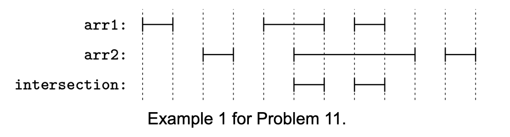

# INTERVAL INTERSECTION

## Problem statement

In this problem, we represent an interval as an array with two integers, [start, end], where start <= end. Both
endpoints are considered part of the interval, which may consist of a singular point if start == end.

You are given two arrays of intervals, arr1 and arr2. For each array, the intervals are non-overlapping (they don't even
share an endpoint) and sorted from left to right. Return a similarly non-overlapping, sorted array of intervals
representing the intersection of the intervals in arr1 and arr2. An interval shouldn't start at the same value where
another interval ends.

## Constraints

- 0 ≤ arr1.length, arr2.length ≤ 10^6
- arr1[i].length = arr2[j].length = 2
- -10^9 ≤ start ≤ end ≤ 10^9 for each interval
- Each list is sorted and non-overlapping (any two intervals from the same list don't even share an endpoint)

## Example 1

### Input

arr1 = [[0, 1], [4, 6], [7, 8]]
arr2 = [[2, 3], [5, 9], [10, 11]]

### Output

[[5, 6], [7, 8]]

Explanation:

- [4, 6] from arr1 intersects with [5, 9] from arr2 to give [5, 6]
- [7, 8] from arr1 intersects with [5, 9] from arr2 to give [7, 8]

## Example 2

### Input

arr1 = [[2, 4], [5, 8]]
arr2 = [[3, 3], [4, 7]]

### Output

[[3, 3], [4, 4], [5, 7]]

Explanation:

- [2, 4] intersects with [3, 3] to give [3, 3]
- [2, 4] intersects with [4, 7] to give [4, 4]
- [5, 8] intersects with [4, 7] to give [5, 7]

The array [[3, 3], [4, 4], [5, 6], [6, 7]] would not be correct because [5, 6]
and [6, 7] can be combined.