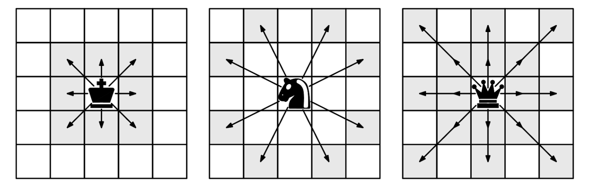
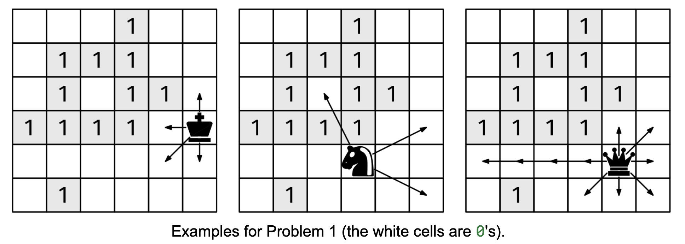

# CHESS MOVES

## Problem statement

For context, this is how the King, Knight, and Queen move on a chessboard:

The king can go to any adjacent cell, including diagonals. The knight 'jumps' one cell in one dimension and two in the
other, even if there are pieces in between. The queen can move any number of cells in any direction, including
diagonals, but cannot go through occupied cells.

We are given three inputs:

board, an nxn binary grid, where a 0 denotes an empty cell, 1 denotes an occupied cell (for this problem, it doesn't
matter what piece is in it) piece, which is one of "king", "knight", or "queen" r and c, with 0 ≤ r < n and 0 ≤ c < n,
which denote an unoccupied position in the board.

Return a list of all the unoccupied cells in board that can be reached by the given piece in one move starting
from [r, c]. The order of the output cells does not matter.

## Constraints

- 1 ≤ n ≤ 100
- board[i][j] is either 0 or 1
- 0 ≤ r, c < n
- piece is one of "king", "knight", or "queen"

## Example 1

### Input

board = [
[0, 0, 0, 1, 0, 0],
[0, 1, 1, 1, 0, 0],
[0, 1, 0, 1, 1, 0],
[1, 1, 1, 1, 0, 0],
[0, 0, 0, 0, 0, 0],
[0, 1, 0, 0, 0, 0]
]
piece = "king"
r = 3
c = 5

### Output

[
[2, 5],
[3, 4],
[4, 4],
[4, 5]
]

## Example 2

### Input

board = [
[0, 0, 0, 1, 0, 0],
[0, 1, 1, 1, 0, 0],
[0, 1, 0, 1, 1, 0],
[1, 1, 1, 1, 0, 0],
[0, 0, 0, 0, 0, 0],
[0, 1, 0, 0, 0, 0]
]
piece = "knight"
r = 4
c = 3

### Output

[
[2, 2],
[3, 5],
[5, 5]
]

## Example 3

### Input

board = [
[0, 0, 0, 1, 0, 0],
[0, 1, 1, 1, 0, 0],
[0, 1, 0, 1, 1, 0],
[1, 1, 1, 1, 0, 0],
[0, 0, 0, 0, 0, 0],
[0, 1, 0, 0, 0, 0]
]
piece = "queen"
r = 4
c = 4

### Output

[
[3, 4],
[3, 5],
[4, 0],
[4, 1],
[4, 2],
[4, 3],
[4, 5],
[5, 3],
[5, 4],
[5, 5]
]
