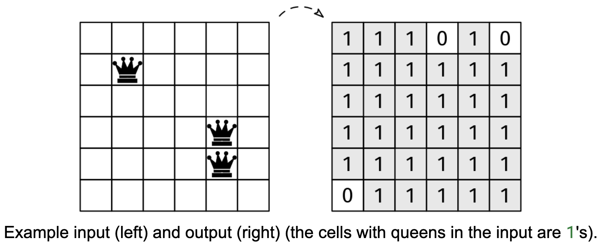

# QUEEN'S REACH

## Problem statement

Imagine that an n x n chessboard has a number of queens in it. Remember that in chess, a queen can move any number of
cells horizontally, vertically, or diagonally.

We are given an nxn binary grid, board, with n > 0, where 0 indicates that the cell is unoccupied, and a 1 indicates a
queen (the color of the queen doesn't matter). Return a binary board with the same dimensions. In the returned board, 0
denotes that a cell is 'safe', and a 1 denotes that a cell is not safe. A cell is safe if there isn't a queen in it and
no queen on the board can reach it in a single move.

## Constraints

- 1 ≤ n ≤ 100
- board[i][j] is either 0 or 1

## Example 1

### Input

board = [
[0, 0, 0, 1],
[0, 0, 0, 0],
[0, 0, 0, 0],
[1, 0, 0, 0]
]

### Output

[
[1, 1, 1, 1],
[1, 0, 1, 1],
[1, 1, 0, 1],
[1, 1, 1, 1]
]

## Example 2

### Input

[
[1]
]

### Output

[
[1]
]

## Example 3

### Input

[
[0]
]

### Output

[
[0]
]