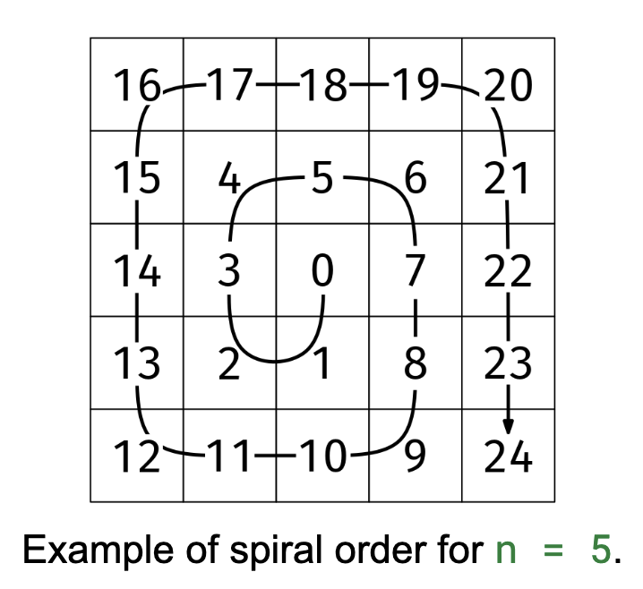

# SPIRAL ORDER

## Problem statement

Given a positive and odd integer n, return an nxn grid of integers filled as follows: the grid should have every number
from 0 to n^2 - 1 in spiral order, starting by going down from the center and turning clockwise.

## Constraints

- 0 < n < 1000
- n is odd

## Example 1

### Input

n = 5

### Output

[
[16, 17, 18, 19, 20],
[15, 4, 5, 6, 21],
[14, 3, 0, 7, 22],
[13, 2, 1, 8, 23],
[12, 11, 10, 9, 24]
]

## Example 2

### Input

n = 3

### Output

[
[4, 5, 6],
[3, 0, 7],
[2, 1, 8]
]

## Example 3

### Input

n = 1

### Output

[
[0],
]