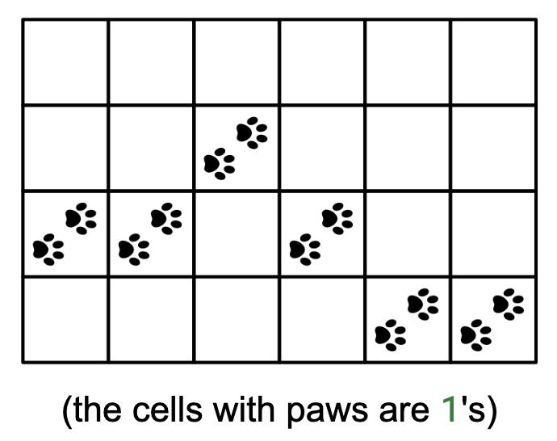

# SNOWPRINTS

## Problem statement

We are tracking Elsa, an arctic fox, through a rectangular snowy field represented by a binary grid, field, where 1
denotes snowprints and 0 denotes no snowprints. We know that the fox crossed the field from left to right, so each
column has exactly one 1. Between two consecutive columns, the row of the 1 may remain the same, go up by one, or go
down by one. Above the field (above the first row), there is an icy river. Return how close the fox got to the river, in
terms of the number of rows between it and the river.

## Constraints

- 1 ≤ R, C ≤ 1000, where R is the number of rows and C is the number of columns
- field[i][j] is either 0 or 1
- Each column has exactly one 1
- The fox's path is valid (moves at most one row up/down between columns)

## Example 1

### Input

field = [
[0, 0, 0, 0, 0, 0],
[0, 0, 1, 0, 0, 0],
[1, 1, 0, 1, 0, 0],
[0, 0, 0, 0, 1, 1]
]

### Output

1

Explanation: The fox was closest to the river at column 2 (0-based), where it
was 1 row away.

## Example 2

### Input

field = [
[0, 0, 0, 1, 0, 0],
[0, 0, 1, 0, 1, 0],
[1, 1, 0, 0, 0, 1],
[0, 0, 0, 0, 0, 0]
]

### Output

0

Explanation: The fox touched row 0, which is right next to the river.

## Example 3

### Input

field = [
[1, 1, 1]
]

### Output

0

Explanation: The fox stayed in row 0 the whole time.