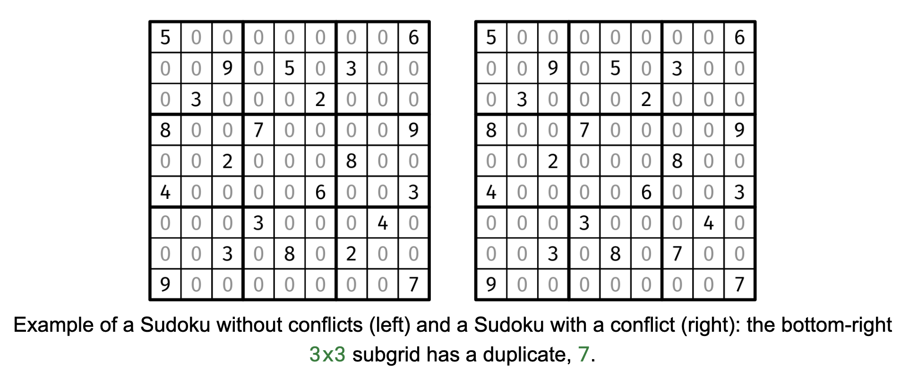

# VALID SUDOKU

## Problem statement

Given a 9x9 grid board representing a Sudoku, return true if the board does not have any conflicts and false otherwise.
The board contains only numbers between 0 and 9 in each cell, with 0's denoting empty cells.

A conflict is a duplicate number (other than 0) along a row, a column, or a 3x3 subgrid (shown with the thicker
outline). For the purposes of this problem, it doesn't matter if the Sudoku has a valid solution or not -- only whether
it has a conflict in the already-filled cells.

For those who don't know the rules of Sudoku: the grid starts off with some cells pre-filled with numbers. The player is
asked to fill in the empty cells with the numbers 1 through 9, such that there are no duplicates in the same row,
column, or subgrid (the 3x3 sections shown with the thicker outline).

## Constraints

- board.length == 9
- board[i].length == 9
- board[i][j] is a digit between 0 and 9.

## Example 1

### Input

board =

        +-------+-------+-------+
        | 5 . . | . . . | . . 6 |
        | . . 9 | . 5 . | 3 . . |
        | . 3 . | . . 2 | . . . |
        +-------+-------+-------+
        | 8 . . | 7 . . | . . 9 |
        | . . 2 | . . . | 8 . . |
        | 4 . . | . . 6 | . . 3 |
        +-------+-------+-------+
        | . . . | 3 . . | . 4 . |
        | . . 3 | . 8 . | 2 . . |
        | 9 . . | . . . | . . 7 |
        +-------+-------+-------+

### Output

true

## Example 2

### Input

board =

    +-------+-------+-------+
    | 5 . . | . . . | . . 6 |
    | . . 9 | . 5 . | 3 . . |
    | . 3 . | . . 2 | . . . |
    +-------+-------+-------+
    | 8 . . | 7 . . | . . 9 |
    | . . 2 | . . . | 8 . . |
    | 4 . . | . . 6 | . . 3 |
    +-------+-------+-------+
    | . . . | 3 . . | . 4 . |
    | . . 3 | . 8 . | 7 . . |
    | 9 . . | . . . | . . 7 |
    +-------+-------+-------+

### Output

false

Explanation: The bottom-right 3x3 subgrid has a duplicate, 7.

## Example 3

### Input

board = 

    +-------+-------+-------+
    | . . . | . . . | . . . |
    | . . . | . . . | . . . |
    | . . . | . . . | . . . |
    +-------+-------+-------+
    | . . . | . . . | . . . |
    | . . . | . . . | . . . |
    | . . . | . . . | . . . |
    +-------+-------+-------+
    | . . . | . . . | . . . |
    | . . . | . . . | . . . |
    | . . . | . . . | . . . |
    +-------+-------+-------+

### Output

true

Explanation: An empty board has no conflicts.