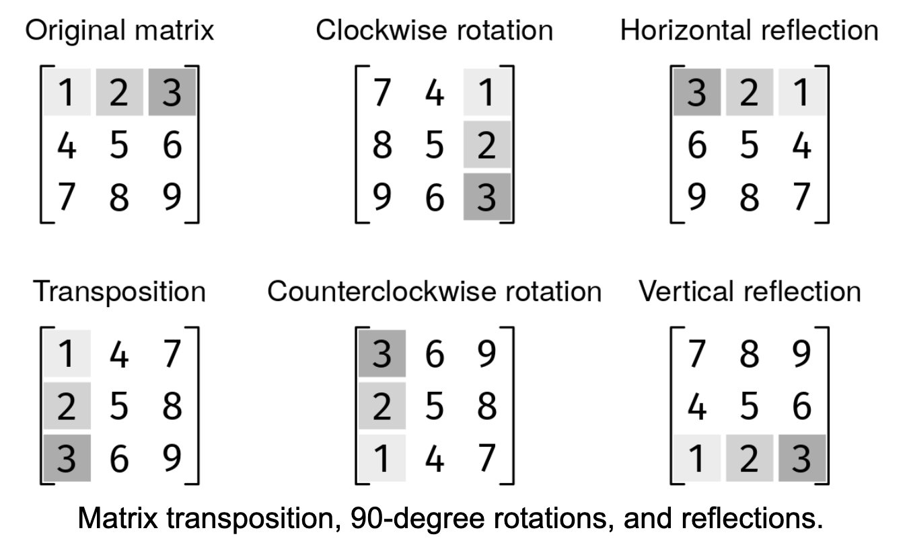

# MATRIX OPERATIONS

## Problem statement

Basic matrix operations sometimes come up in coding interviews because they involve interesting grid transformations,
but they usually don't assume background knowledge.

- Transposition: The first row becomes the first column, the second row becomes the second column, and so on.
- Rotation: A transformation that turns the matrix 90 degrees, clockwise or counterclockwise.
- Horizontal reflection: The first column becomes the last column, the second column becomes the second last, and so on.
- Vertical reflection: The first row becomes the last row, the second row becomes the second last, and so on.

Implement a Matrix class that can be initialized with a square grid of floating point numbers. It must have methods for
transposition, clockwise rotation, anticlockwise rotation, horizontal reflection, and vertical reflection. All the
methods take zero parameters and should modify the matrix in place, using only O(1) extra space, and return nothing.

## Constraints

- 1 ≤ n ≤ 1000 where n is the size of the square matrix
- -10^4 ≤ grid[i][j] ≤ 10^4

## Example 1

### Input

Transposition

grid = [
[1, 2],
[3, 4]
]

### Output

[[1, 3],
[2, 4]]

## Example 2

### Input

Clockwise Rotation

grid = [
[1, 2],
[3, 4]
]

### Output

[[3, 1],
[4, 2]]

## Example 3

### Input

Horizontal Reflection

grid = [
[1, 2],
[3, 4]
]

### Output

[[2, 1],
[4, 3]]