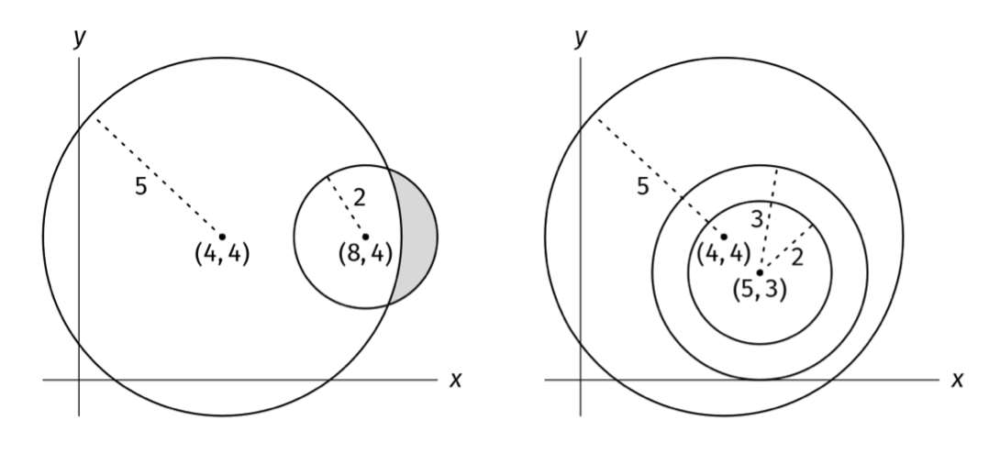

# NESTED CIRCLES

## Problem statement

You are given a non-empty array of circles, circles, where each circle is specified by its center coordinates (x, y) and
its radius r. Your task is to determine whether the circles are nested. For the circles to be considered nested, one of
the following conditions must be met:

1. There is a single circle.
2. One circle completely surrounds all the others (without touching boundaries), and the other circles are themselves
   nested (this is a recursive definition).
   Write a function that returns a boolean indicating whether the circles are nested.

## Constraints

- The length of word is at most 10^5
- word contains only lowercase letters

## Example 1

### Input

circles = [
((4, 4), 5), # Circle with center (4, 4) and radius 5
((8, 4), 2)   # Circle with center (8, 4) and radius 2
]

### Output

false.

Neither circle is surrounded by the other.

## Example 2

### Input

circles = [
((5, 3), 3),
((5, 3), 2),
((4, 4), 5)
]

### Output

true.

The third circle contains all the first and second circles, and
the first circle contains the second circle.

## Example 1

### Input

circles = [((5, 3), 3)]

### Output

true.

A single circle is considered nested.
