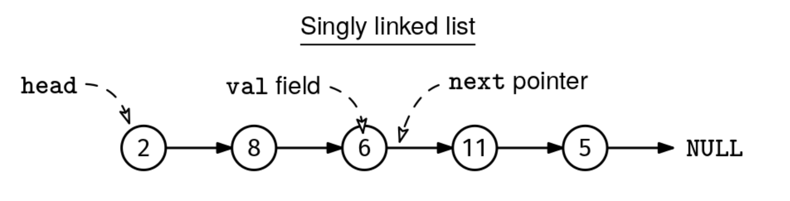

# SINGLY LINKED LIST DESIGN

## Problem statement

Implement a SinglyLinkedList class with the following methods:

```
push_front(v):
    Adds a node with value v at the beginning of the list.

pop_front():
    Removes the node at the beginning of the list and returns its value.
    If the list is empty, returns None.

push_back(v):
    Adds a node with value v at the end of the list.

pop_back():
    Removes the node at the end of the list and returns its value.
    If the list is empty, returns None.

size():
    Returns the number of nodes in the list.

contains(v):
    Return the first node with value v, if any, or null otherwise.
```

This diagram shows the typical structure of a singly linked list:



## Constraints

- You have to create the Node class with a val field and a next pointer. If your language is typed, you can either make
  the type of val be generic or integer.
- The push_front(), pop_front(), and size() methods should take O(1) time if the elements are integers.
- The list can contain up to 10^5 nodes.

## Example 1

```
list = SinglyLinkedList()
list.pop_front()    # Returns None (empty list)
list.pop_back()     # Returns None (empty list)
list.size()         # Returns 0
list.push_front(1)  # List is now: 1
list.push_front(2)  # List is now: 2->1
list.push_back(3)   # List is now: 2->1->3
list.contains(2)    # Returns node with value 2
list.contains(4)    # Returns None (value not found)
list.size()         # Returns 3
list.pop_front()    # Returns 2, list is now: 1->3
list.pop_back()     # Returns 3, list is now: 1
```