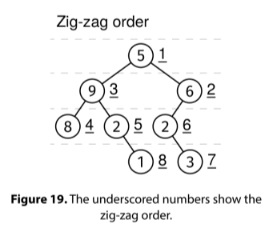

# ZIG ZAG ORDER

## Problem statement

Given a binary tree, return the values of all its nodes in zig-zag order. This is similar to a level-order traversal but
alternating the direction of the nodes at each level. Nodes at even depth are ordered left to right, and nodes at odd
depth are ordered right to left.



## Constraints

- The number of nodes is at most 10^5
- The values at each node are between 0 and 10^9

## Example 1

### Input

```
    1
   / \
  2   3
 / \   \
4   5   6
```
### Output

[1, 3, 2, 4, 5, 6]