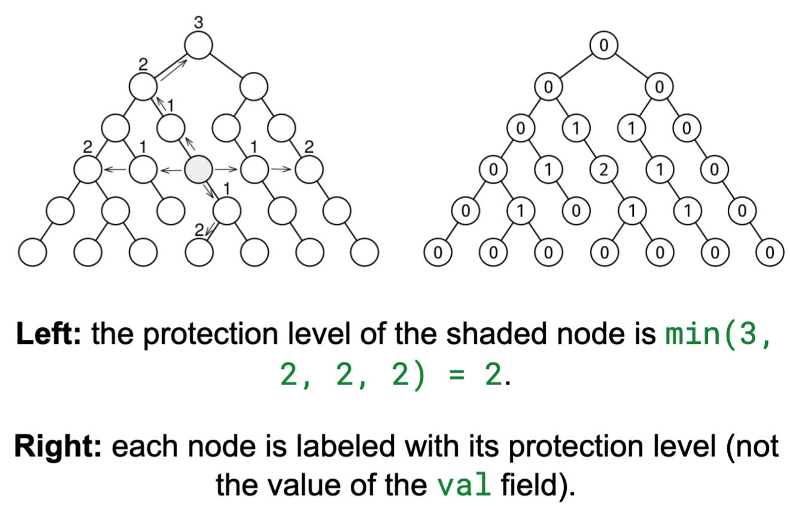

# MOST PROTECTED NODE

## Problem statement

Given the root of a non-empty binary tree, return the highest protection level of any node. The protection level of a
node is the minimum of four values:

1. The number of ancestors
2. The length of the longest chain of descendants
3. The number of nodes on the same level to its left
4. The number of nodes on the same level to its right



## Constraints

- The number of nodes is at most 10^5
- The height of the tree is at most 500
- The value at each node doesn't matter.

## Example 1

### Input

```
            O
         /     \
        O       O
       / \     / \
      O   O   O   O
     / \   \   \   \
    O   O   O   O   O
   / \   \   \   \   \
  O   O   O   O   O   O
 /   / \     / \   \   \
O   O   O   O   O   O   O
```

### Output

The protection level of each node is:

```
            0
         /     \
        0       0
       / \     / \
      0   1   1   0
     / \   \   \   \
    0   1   2   1   0
   / \   \   \   \   \
  0   1   0   1   1   0
 /   / \     / \   \   \
0   0   0   0   0   0   0
```