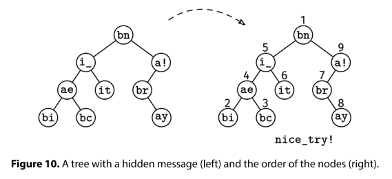

# HIDDEN MESSAGE

## Problem statement

The self-proclaimed 'cryptography expert' in your friend group has devised their own schema to hide messages in binary
trees. Each node has a text field with exactly two characters. The first character is either 'b', 'i', or 'a'. The
second character is part of the hidden message. To decode the message, you have to read the hidden-message characters in
the following order:

- If the first character in a node is 'b', the node goes before its left subtree, and the left subtree goes before the
  right subtree.
- If it is 'a', the node goes after its right subtree, and the right subtree goes after the left subtree.
- If it is 'i', the node goes after its left subtree and before its right subtree.

Given the root of the binary tree, return the hidden message as a string.



## Constraints

- Assume we have a binary tree node class with a left and right fields, and a text field.
- The number of nodes is at most 10^5
- The height of the tree is at most 500
- The text field is a string of length 2. The first character is either 'b', 'i', or 'a'. The second character is a
  letter or number.

## Example 1

### Input

```
                 bn
               /    \
             i_      a!
            /  \     /
          ae    it  br
         /  \         \
       bi    bc        ay
```

### Output

"nice_try!"