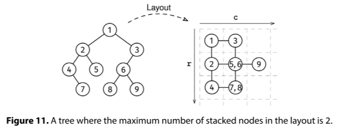

# TREE LAYOUT

## Problem statement

You are given the root of a non-empty binary tree. We lay out the tree on a grid as follows:

1. We put the root at (r, c) = (0, 0)
2. We recursively lay out the left subtree one unit below the root (increasing r by one)
3. We recursively lay out the right subtree one unit to the root's right (increasing c by one)

For instance, the left child of the root goes on (1, 0) and the right child goes on (0, 1).

Two nodes are stacked if they are laid on the same (r, c) coordinates. For instance, root.left.right and root.right.left
would overlap at (1, 1).

Return the maximum number of nodes stacked on the same coordinate.



## Constraints

- The number of nodes is at most 10^5
- The height of the tree is at most 500
- The value at each node doesn't matter.

## Example 1

### Input

```
         1
       /   \
     2       3
   /  \     /
  4    5   6
   \      / \
    7    8   9
```

### Output

2
The layout looks like this:

```

1 -- 3
|    |
2 - 5,6 - 9
|    |
4 - 7,8
```

The most stacked nodes are 5,6 or 7,8.