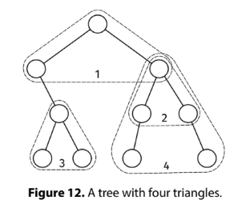

# TRIANGLE COUNT

## Problem statement

Given the root of a binary tree, return the number of triangles. A triangle is a set of three distinct nodes, a, b, and
c, where:

- a is the lowest common ancestor of b and c.
- b and c have the same depth.
- the path from a to b only consists of left children (the nodes in the path can have right children).
- the path from a to c only consists of right children (the nodes in the path can have left children).



## Constraints

- The number of nodes is at most 10^5
- The height of the tree is at most 500
- The value at each node doesn't matter.

## Example 1

### Input

```
         0
     /       \
    1         2
     \       / \
      3     4   5
     / \   /     \
    6   7 8       9
```

### Output

4

The triangles are: (0, 1, 2), (3, 6, 7), (2, 4, 5), (2, 8, 9).

## Example 1

### Input

```
      0
   /      \
  1        4
 /  \       \
2    3       5
```

### Output

3

The triangles are: (0, 1, 4), (1, 2, 3), (0, 2, 5).