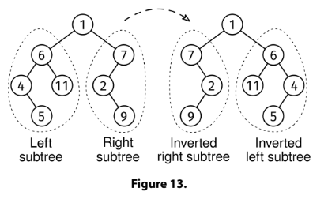

# INVERT A BINARY TREE

## Problem statement

Given a binary tree, invert it by modifying the left and right pointers (do not modify the values in the nodes or create
new nodes).

The left subtree of the root should become the right subtree inverted, and the right subtree of the root should become
the left subtree inverted.

Return the root of the tree after modifying it.



## Constraints

## Example 1

### Input

```
     1
   /   \
  6     7
 / \   /
4  11 2
 \     \
  5     9
```

### Output

```
     1
   /   \
  7     6
   \   / \
    2 11  4
   /     /
  9     5
```