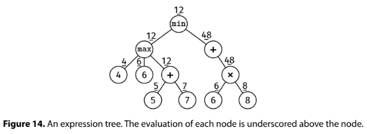

# EVALUATE EXPRESSION TREE

## Problem statement

We are given the root of a tree representing an arithmetic expression.

The node definition has three fields: kind, num, and children.

- The kind field determines the node's type. There are 'Number' nodes, which have kind = "num", and 'Operation' nodes,
  where kind is one of "sum", "product", "max", or "min".
- The num field is only valid for 'Number' nodes. It stores an integer value.
- The children field is only valid for 'Operation' nodes. It stores a list of child nodes (there are no null children).

This is not a binary tree, as nodes can have more than two children. We call this an N-ary tree.

Implement an evaluate() function which evaluates the tree according to the following rules:

- The value of a 'Number' node is its num field.
- The value of an 'Operation' node depends on its kind: it is the sum, product, max, or min of the children's values (
  the product of a single value is itself).

## Constraints

- The number of nodes is at most 10^5
- The height of the tree is at most 500
- 'Number' nodes have values between -10^4 and 10^4
- It is guaranteed that the evaluation at every node will be between -10^4 and 10^4

## Example 1

### Input

```
     min
    /   \
 max     +
 /|\      \
4 6 +      *
   / \    / \
  5   7  6   8
```

### Output

12

