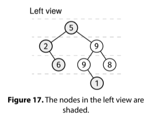

# LEFT VIEW

## Problem statement

Given the root of a binary tree, return its left view. The left view is an array with the value of the first node on
each layer, ordered from top to bottom.



## Constraints

- The number of nodes is at most 10^5
- Each node has a value between 0 and 10^9

## Example 1

### Input

```
    1
   / \
  2   3
   \   \
    5   6
         \
          7
```

### Output

[1, 2, 5, 7]