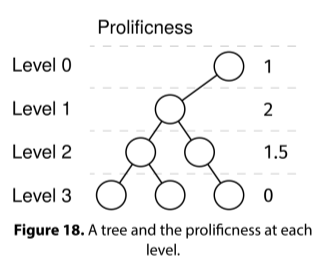

# MOST PROLIFIC LEVEL

## Problem statement

Given the root of a binary tree, return the most prolific level. The prolificness of a level is the average number of
children over all the nodes in that level. Return -1 if the tree is empty.



## Constraints

- The number of nodes is at most 10^5
- The value at each node doesn't matter.

## Example 1

### Input

```
      O
     /
    O
   / \
  O   O
 / \   \
O   O   O
```

### Output

1

- Level 0 has prolificness 1
- Level 1 has prolificness 2
- Level 2 has prolificness 1.5
- Level 3 has prolificness 0

The most prolific level is 1, with a prolificness of 2.