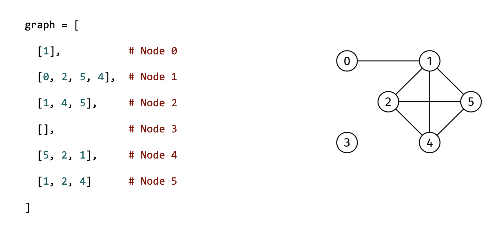

# SHORTEST-PATH QUERIES

## Problem statement

You are given the adjacency list of an undirected graph, graph, a node index, start, and an array, queries, where each
element is a node index.

Return an array with the same length as queries, where the i-th element is an array with the shortest path from start to
queries[i].

If there is no path from start to queries[i], return an empty array for the i-th element.

## Constraints

- graph.length <= 10^4
- graph[i].length < 10^4
- 0 <= graph[i][j] < graph.length
- 0 <= start < graph.length
- queries.length <= 10^3
- 0 <= queries[i] < graph.length
- The graph is well-formed, with no parallel edges or self-loops

## Example 1

### Input

graph = [
[1],            # Node 0
[0, 2, 5, 4],   # Node 1
[1, 4, 5],      # Node 2
[],             # Node 3
[5, 2, 1],      # Node 4
[1, 2, 4]       # Node 5
]

start = 0

queries = [1, 0, 3, 4]

### Output

[[0, 1], [0], [], [0, 1, 4]]

Node 3 cannot be reached from node 0

## Example 2

### Input

graph = [
[1],        # Node 0
[0, 2],     # Node 1
[1]         # Node 2
]

start = 0

queries = [1, 2]

### Output

[[0, 1], [0, 1, 2]]

## Example 3

### Input

graph = [
[1], # Node 0
[0], # Node 1
[3], # Node 2
[2]  # Node 3
]

start = 0

queries = [1, 2, 3]

### Output

[[0, 1], [], []]

Can only reach node 1 from node 0