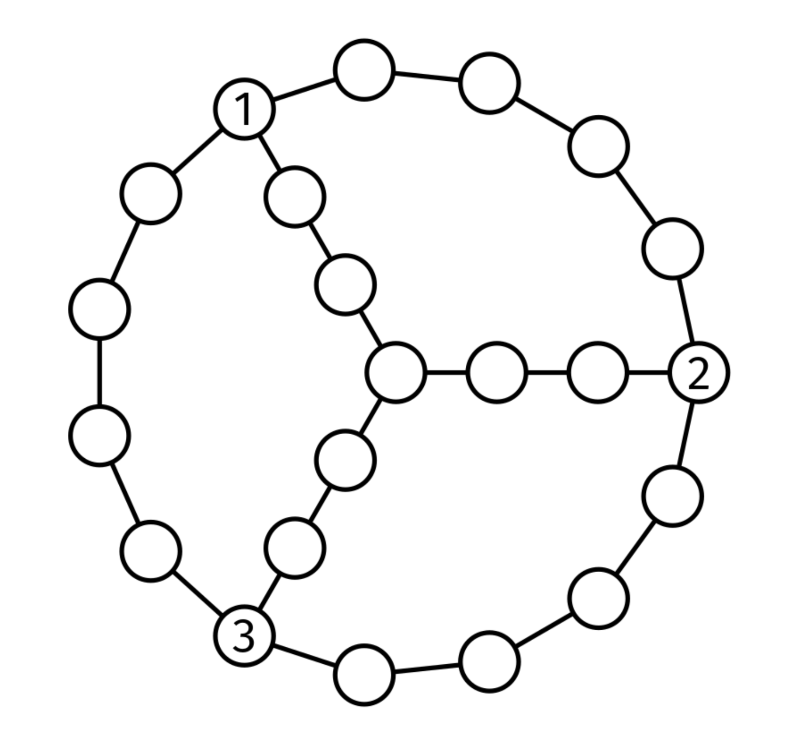

# GRAPH HANGOUT

## Problem statement

Three friends want to meet. They live in nodes in a connected, undirected graph.

You are given the adjacency list, graph, and the nodes where they start, node1, node2, and node3.

Return the minimum number of edges they need to traverse in total between the three to meet at any node in the graph.

For example, for this graph:

If the three friends start at the nodes labeled 1, 2 and 3, they can each get to the middle node by traversing 3 edges.
The next closest meeting point is at one of the starting nodes, where the other two friends have to traverse 5 edges
each. Thus, the answer is 9.

## Constraints

- graph.length <= 10^4
- graph[i].length < 10^4
- 0 <= graph[i][j] < graph.length
- 0 <= node1, node2, node3 < graph.length
- The graph is well-formed, with no parallel edges or self-loops

## Example 1

### Input

### Output
