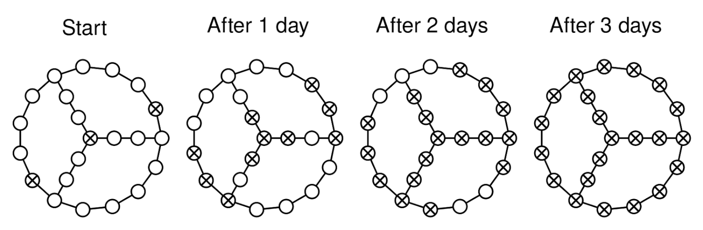

# DAYS UNTIL ALL INFECTED

## Problem statement

Some computers in a network have been infected by a virus. We are given the adjacency list of an undirected, connected
graph, graph, representing the computer network, and an array, infected, with the indices of the infected nodes.

Every day, the virus spreads to all computers directly connected to an infected neighbor computer.

How many days will it take to infect all computers?

For example, for this graph:

It takes 3 days for the virus to infect all computers.

## Constraints

- 1 <= graph.length <= 10^4
- graph[i].length < 10^4
- 0 <= graph[i][j] < graph.length
- 1 <= infected.length <= graph.length
- 0 <= infected[i] < graph.length
- infected does not contain duplicates
- The graph is well-formed, with no parallel edges or self-loops
- The graph is connected

## Example 1

### Input

graph = [
[1, 2], # Node 0
[0, 2], # Node 1
[0, 1, 3], # Node 2
[2]           # Node 3
]

infected = [0]

### Output

2

On day 1, nodes 1 and 2 get infected.
On day 2, node 3 gets infected

## Example 2

### Input

graph = [
[1], # Node 0
[0, 2], # Node 1
[1, 3], # Node 2
[2, 4], # Node 3
[3], # Node 4
]

infected = [0, 4]

### Output

2

The virus spreads through the line graph from both ends.

## Example 3

### Input

graph = [
[1, 2], # Node 0
[0, 3], # Node 1
[0, 3], # Node 2
[1, 2], # Node 3
]

infected = [0, 3]

### Output

1.

With two initial infected nodes, all other nodes are infected after
one day.