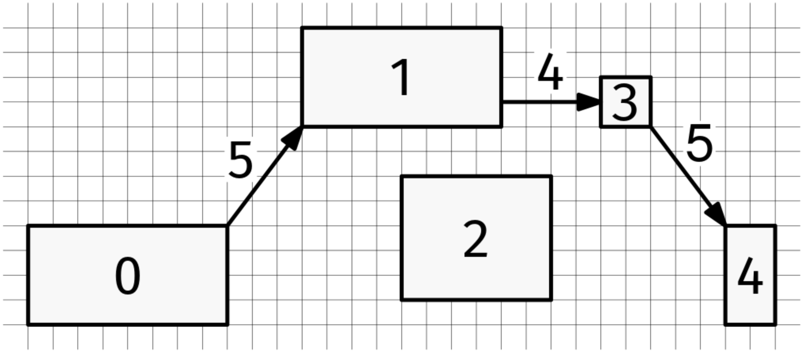

# THE FLOOR IS LAVA

## Problem statement

We are given an array, furniture, where each element consists of four integer coordinates, [x_min, y_min, x_max, y_max],
indicating the boundary of a rectangular piece of furniture. The furniture pieces are non-overlapping (they can share an
edge or a corner).

We are playing the game 'the floor is lava,' where we have to reach from the first piece of furniture (the one at index
0 in furniture) to the last one without touching the floor, only jumping on furniture. If we can jump at most a distance
of d, where d is an integer, can we win?

Recall that:

distance((x1, y1), (x2, y2)) = sqrt((x1 - x2)^2 + (y1 - y2)^2).

For example, if this is the furniture and d is 5, we can jump from the furniture labeled 0 to the one labeled 4 with the
indicated jumps:

However, if d is 4 for the same furniture, we can't do it.

## Constraints

- 2 <= furniture.length <= 1000
- furniture[i] is a list of 4 integers
- 0 <= furniture[i][0] < furniture[i][2] < 10^9
- 0 <= furniture[i][1] < furniture[i][3] < 10^9
- The furniture pieces are non-overlapping
- 0 < d <= 10^9
- All coordinates and distances are floating-point numbers

## Example 1

### Input

furniture = [
[1, 1, 9, 5],
[12, 9, 20, 13],
[16, 2, 22, 7],
[24, 9, 26, 11],
[29, 1, 31, 5]
]

d = 5

### Output

True

See the image above

## Example 2

### Input

furniture = [
[1, 1, 9, 5],
[12, 9, 20, 13],
[16, 2, 22, 7],
[24, 9, 26, 11],
[29, 1, 31, 5]
]

d = 4

### Output

False

See the image above