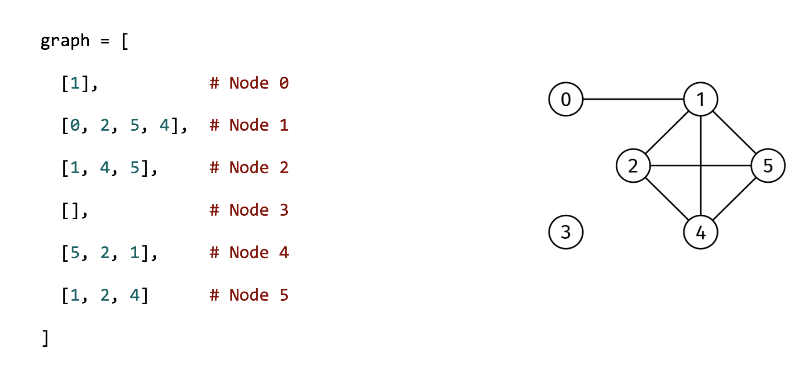

# GRAPH PATH

## Problem statement

Given the adjacency list of an undirected graph, graph, and two distinct nodes, node1 and node2, return a simple path
from node1 to node2.

A simple path does not repeat any nodes. Return an empty array if there is no path from node1 to node2.

## Constraints

- graph.length ≤ 1000
- graph[i].length < 1000
- 0 ≤ graph[i][j] < graph.length
- 0 ≤ node1, node2 < graph.length
- node1 != node2
- The adjacency list is properly formatted, with no parallel edges or self-loops

## Example 1

### Input

graph = [
[1],
[0, 2, 5, 4],
[1, 4, 5],
[],
[5, 2, 1],
[1, 2, 4]
]
node1 = 0
node2 = 4

### Output

[0, 1, 4]
There are other valid answers, like [0, 1, 2, 5, 4].

## Example 2

### Input

graph = [
[1],
[0, 2, 5, 4],
[1, 4, 5],
[],
[5, 2, 1],
[1, 2, 4]
]
node1 = 0
node2 = 3

### Output

[]
There is no path to node 3.

## Example 3

### Input

graph = [
[1],
[0, 2],
[1]
]
node1 = 0
node2 = 2

### Output

[0, 1, 2]
A simple path through all nodes.