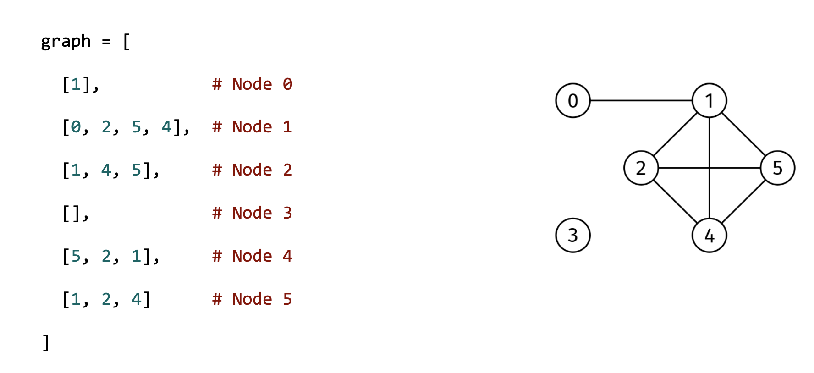

# REACHABILITY QUERIES

## Problem statement

You are given the adjacency list of an undirected graph, graph, as well as an array, queries, of length k, where
queries[i] is a pair of node indices. Return a boolean array of length k where the i-th element indicates if the nodes
in queries[i] are in the same connected component.

A connected component is a maximal set of nodes that are all reachable from each other.

## Constraints

- graph.length ≤ 1000
- graph[i].length < 1000
- 0 ≤ graph[i][j] < graph.length
- The adjacency list is properly formatted, with no parallel edges or self-loops
- queries.length ≤ 1000
- 0 ≤ queries[i][0], queries[i][1] < graph.length
- queries[i][0] != queries[i][1]

## Example 1

### Input

graph = [
[1], # Node 0
[0, 2, 5, 4], # Node 1
[1, 4, 5], # Node 2
[], # Node 3
[5, 2, 1], # Node 4
[1, 2, 4]      # Node 5
]

queries = [[0, 4], [0, 3]]

### Output

[True, False]

The True corresponds to query [0, 4] and the False to query [0, 3].

## Example 2

### Input

graph = [
[1], # Node 0
[0, 2], # Node 1
[1]            # Node 2
]

queries = [[0, 2], [0, 1]]

### Output

[True, True]

All nodes are in the same connected component.

## Example 3

### Input

graph = [
[1], # Node 0
[0], # Node 1
[3], # Node 2
[2]            # Node 3
]

queries = [[0, 1], [0, 2], [2, 3]]

### Output

[True, False, True]

The graph has two connected components: {0, 1} and {2, 3}.