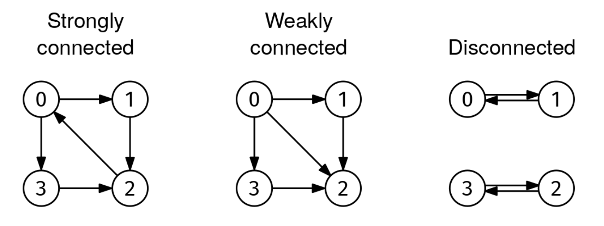

# STRONGLY CONNECTED COMPONENTS

## Problem statement

Given the adjacency list of a non-empty directed graph, graph, return whether it is strongly connected.

A directed graph is strongly connected if every node can reach every other node (in a directed graph, it is possible
that node1 can reach node2 but not the other way around).

Below is an image of strongly connected, weakly connected, and disconnected directed graphs. A directed graph is weakly
connected if it would be connected if edges didn't have directions.

## Constraints

## Example 1

### Input

graph = [
[1, 3], # Node 0
[2],    # Node 1
[0],    # Node 2
[2]     # Node 3
]

### Output

True.
Left graph in the image above

## Example 2

### Input

graph = [
[1, 2, 3],  # Node 0
[2],        # Node 1
[],         # Node 2
[2]         # Node 3
]

### Output

False.
Middle graph in the image above. Node 2 cannot reach node 0, among others

## Example 3

### Input

graph = [
[1],        # Node 0
[0],        # Node 1
[3],        # Node 2
[2]         # Node 3
]

### Output

False.
Right graph in the image above. Node 0 cannot reach node 3, among others