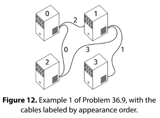

# FIRST TIME ALL CONNECTED

## Problem statement

We are given V >= 2, the number of computers in a data center. The computers are identified with indices from 0 to V -

1.

We are also given a list, cables, of length E where each element is a pair [x, y], with 0 ≤ x, y < V and x != y,
indicating that we should connect the computers with indices x and y with a cable.

If we add the cables in the order of the list, at what point will all the computers be connected (meaning that there is
a path of cables between every pair of computers)?

Return the index of the cable in cables after which all the computers are connected or -1 if that never happens.

For example, in this figure, if we add the cables in order, the computers become all connected after adding cables 0, 1,
and 2.

## Constraints

- 2 <= V <= 10^4
- 0 <= E <= 10^5
- 0 <= cables[i][0], cables[i][1] < V
- cables[i][0] != cables[i][1]
- all the cables are unique

## Example 1

### Input

V = 4

cables = [
[0, 2],
[1, 3],
[0, 1],
[1, 2]
]

### Output

2

See image above

## Example 2

### Input

V = 3

cables = [[0, 1]]

### Output

-1

It's impossible to connect 3 computers with only one cable

## Example 3

### Input

V = 4

cables = [[0, 1], [1, 2], [2, 0], [2, 3], [3, 0]]

### Output

3

Redundant cables don't affect the result