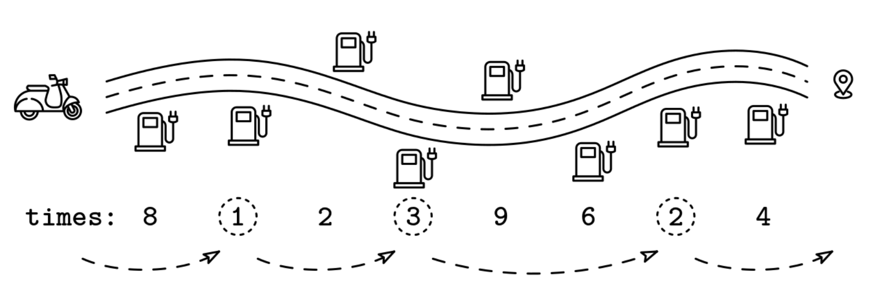

# ROAD TRIP

## Problem statement

We are driving down a road with n rest stops between us and our destination. For each rest stop, our mapping software
tells us how long of a detour it would be to stop there. We start before the first rest stop and our destination is past
the last one.

We are given an array of n positive integers, times, indicating the delay incurred to stop at each rest stop. If we
don't want to go more than 2 rest stops without taking a break, what's the least amount of time we have to spend on
detours?

## Constraints

## Example 1

### Input

times = [8, 1, 2, 3, 9, 6, 2, 4]

### Output

6

The optimal rest stops are: [8, *1*, 2, *3*, 9, 6, *2*, 4]

## Example 2

### Input

times = [8, 1, 2, 3, 9, 3, 2, 4]

### Output

5

The optimal rest stops are: [8, 1, *2*, 3, 9, *3*, 2, 4]

## Example 3

### Input

times = [10, 10]

### Output

0

We don't need to make any stops.

## Example 4

### Input

times = [10]

### Output

0

We don't need to make any stops.

## Example 5

times = []

### Output

0

We don't need to make any stops.

