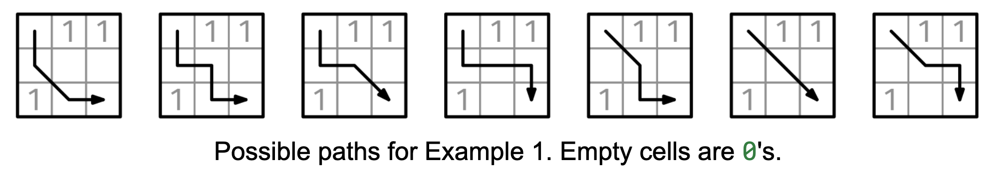

# COUNT 0-SUM PATHS

## Problem statement

Given a non-empty RxC binary grid, grid, return the number of paths from the top-left corner to the bottom-right corner
with a sum of 0. You can only go down, to the right, or diagonally down and to the right.

## Constraints

- R is at least 1 and at most 1000.
- C is at least 1 and at most 1000.
- Each element in the grid is either 0 or 1.

## Example 1

### Input

grid = [
[0, 1, 1],
[0, 0, 0],
[1, 0, 0]
]

### Output

7

## Example 2

### Input

grid = [
[1]
]

### Output

0

## Example 1

### Input

grid = [
[0, 0],
[0, 0]
]

### Output

3