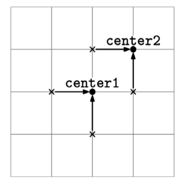

# CENTER ASSIGNMENT

## Problem statement

You are given:

1. A list of points on a 2D plane, points, where each point is represented as [x, y] (floating-point coordinates). The
   list always contains an even number of points.
2. Two additional points, center1 and center2, each also represented as [x, y].

Your task is to divide the points in points into two groups of equal size:

- Assign half of the points to center1.
- Assign the other half to center2.

The goal is to minimize the sum of the (Euclidean) distance from each point to its assigned center. Return the sum of
distances for an optimal assignment.

## Constraints

- points.length is even.
- 0 <= points.length <= 10^5.
- All coordinates are between -10^4 and 10^4.
- The answer should be a real-point within 10^-3 of the correct answer.

## Example 1

### Input

points = [[0, 1], [1, 0], [-1, 0], [0, -1]]
center1 = [0, 0]
center2 = [1, 1]

### Output

4

We can assign [-1, 0] and [0, -1] to center1 and [0, 1] and [1, 0] to center2.

## Example 3

### Input

points = [[0, 0], [0, 0]]
center1 = [0, 0]
center2 = [1, 1]

### Output

1.414

One of the points has to be assigned to center2, which is at distance sqrt(2)
from [0, 0].

## Example 3

### Input

points = [[0, 0.5], [1, 0.5]]
center1 = [0, 0]
center2 = [1, 1]

### Output

1

## Example 4

### Input

points = []
center1 = [0.3, -3.3]
center2 = [-1.6, 4.6]

### Output

0