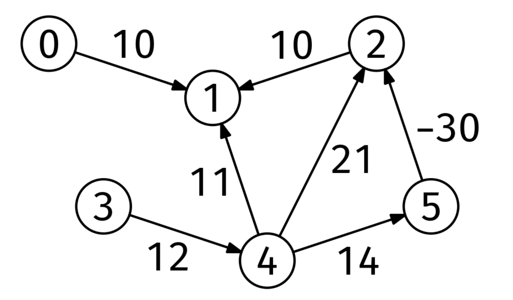

# DAG DISTANCES

## Problem statement

Given the adjacency list of a DAG (Directed Acyclic Graph) with edge weights, graph, and a node, start, return the
distances from start to every other node in an array of length V (the number of nodes). Element i should be the distance
from start to node i. If i cannot be reached from start, that element should be infinity. The edge weights can be
negative.

## Constraints

- The number of nodes is at most 10^5
- The number of edges is at most 10^6
- Each node is labeled from 0 to V-1
- The edge weights are integers between -10^4 and 10^4

## Example 1

### Input

```
graph = [
[[1, 10]],                    # Neighbors of node 0
[],                           # Neighbors of node 1
[[1, 10]],                    # Neighbors of node 2
[[4, 12]],                    # Neighbors of node 3
[[1, 11], [2, 21], [5, 14]],  # Neighbors of node 4
[[2, -30]]                    # Neighbors of node 5
]
```

start = 4



### Output

[infinity, -6, -16, infinity, 0, 14]

Nodes 0 and 3 are unreachable from node 4.
ode 4 is at distance 0 from itself.
The shortest path from node 4 to node 1 is 4 -> 5 -> 2 -> 1.