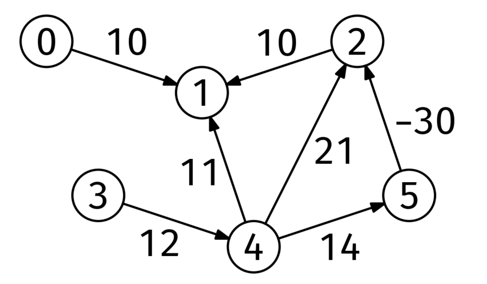

# DAG PATH RECONSTRUCTION

## Problem statement

Given the adjacency list of a DAG with edge weights, graph, and a pair of nodes, start and goal, return the shortest
path from start to goal, or an empty array if goal cannot be reached from start. The edge weights can be negative.

## Constraints

- The number of nodes is at most 10^5
- The number of edges is at most 10^6
- Each node is labeled from 0 to V-1
- The edge weights are integers between -10^4 and 10^4

## Example 1

### Input

```
graph = [
[[1, 10]],                    # Neighbors of node 0
[],                           # Neighbors of node 1
[[1, 10]],                    # Neighbors of node 2
[[4, 12]],                    # Neighbors of node 3
[[1, 11], [2, 21], [5, 14]],  # Neighbors of node 4
[[2, -30]]                    # Neighbors of node 5
]
```

start = 4
goal = 1



### Output

[4, 5, 2, 1]
The shortest path from node 4 to node 1 is 4 -> 5 -> 2 -> 1.