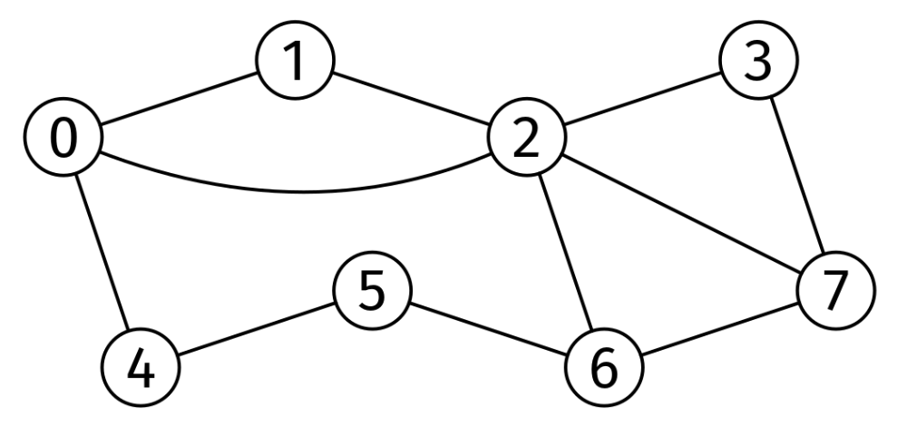

# LONGEST PATH OF INCREASING DEGREE

## Problem statement

Given the number of nodes and the edge list of an unweighted, undirected graph, V and edges, find the longest path where
every node has a higher degree than the previous one and return its length.

## Constraints

- The number of nodes is at most 10^5
- The number of edges is at most 10^6
- Each node is labeled from 0 to V-1
- edges[i].length == 2

## Example 1

### Input

V = 8

edges = [
[0, 1], [1, 2], [2, 3], [0, 2], [0, 4], [2, 6],
[3, 7], [2, 7], [4, 5], [5, 6], [6, 7]
]

### Output

3

One of the longest paths with increasing degrees is 5 -> 6 -> 2 (degrees 2, 3,
and 5). Other longest paths include 1 -> 0 -> 2.