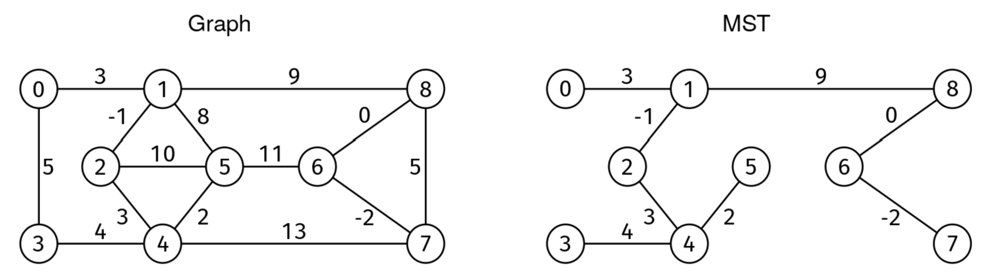

# MINIMUM SPANNING TREE

## Problem statement

Given a weighted, undirected, connected graph, find a minimum spanning tree (MST) and return the sum of its edge
weights.

- A spanning tree is a subset of edges that connects (i.e., "spans") every node and has no cycles.
- The minimum spanning tree is the spanning tree with minimum edge weight sum. The MST may not be unique.

The graph is given as an edge list. We are given V, the number of nodes, and edges, an edge list where each entry is a
triplet [u, v, w], where u and v are the endpoints of an edge, and w is the weight. Nodes are identified by integers
from 0 to V-1. Weights can be positive, zero, or negative.

## Constraints

- 2 <= V <= 1000 (number of vertices)
- V-1 <= edges.length <= V*(V-1)/2 (connected graph)
- 0 <= u, v < V for each edge [u, v, w]
- -10^6 <= w <= 10^6 for each edge [u, v, w]
- The graph is connected (spanning tree exists)

## Example 1

### Input

V = 9,

edges = [[0, 1, 3], [1, 8, 9], [8, 7, 5], [7, 4, 13], [4, 3, 4], [3, 0, 5],
[1, 5, 8], [5, 4, 2], [4, 2, 3], [2, 1, -1], [2, 5, 10], [5, 6, 11],
[6, 8, 0], [6, 7, -2]]

### Output

18

The sum of weights of MST edges is -2 + -1 + 0 + 2 + 3 + 3 + 4 + 9.