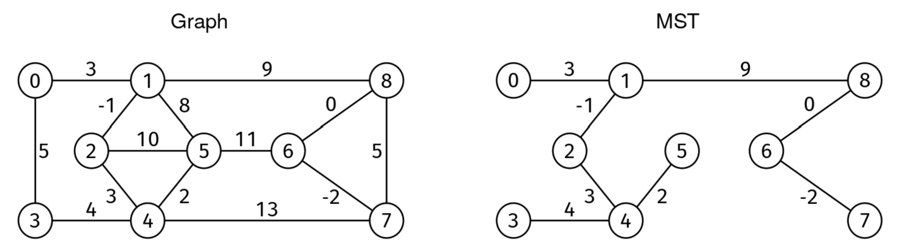

# MST RECONSTRUCTIONS

## Problem statement

Given a weighted, undirected graph, find a minimum spanning tree (MST) and return an array with the edges in it. If the
MST is not unique, return any of them. If the graph is not connected, return an empty list.

- A spanning tree is a subset of edges that connects (i.e., "spans") every node and has no cycles.
- The minimum spanning tree is the spanning tree with minimum edge weight sum.

The graph is given as an edge list. We are given V, the number of nodes, and edges, an edge list where each entry is a
triplet [u, v, w], where u and v are the endpoints of an edge, and w is the weight. Nodes are identified by integers
from 0 to V-1. Weights can be positive, zero, or negative.

## Constraints

## Example 1

### Input

V = 9,

edges = [[0, 1, 3], [1, 8, 9], [8, 7, 5], [7, 4, 13], [4, 3,
4], [3, 0, 5], [1, 5, 8], [5, 4, 2], [4, 2, 3], [2, 1, -1], [2, 5, 10], [5, 6,
11], [6, 8, 0], [6, 7, -2]]

### Output

[[0, 1, 3], [1, 8, 9], [4, 3, 4], [5, 4, 2], [4, 2, 3], [2, 1, -1],
[6, 8, 0], [6, 7, -2]].

## Example 2

### Input

V = 3,

edges = [[0, 1, 1]]

### Output

[]. The graph is not connected.

## Example 3

### Input

V = 3,

edges = [[0, 1, 1], [1, 2, 1], [2, 0, 1]]

### Output

[[0, 1, 1], [1, 2, 1]]. The solution is not unique.
